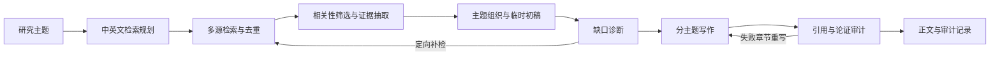

# 架构与原理

LitReview Agent 用 Python 流水线连接学术检索、模型推理和确定性检查。模型负责理解研究问题、判断文献相关性、抽取与综合证据；程序负责 API 请求、去重、文件记录、引用约束和质量检查。

## 两个检查闭环

**证据覆盖。** 系统先根据已有论文形成临时初稿，再检查薄弱主题、经典与近期研究、中文材料、反证以及证据阶段。补检文献需要重新经过筛选和抽取，并进入最终主题，才算对综述产生了实际作用。

**写作质量。** 最终写作仅使用入选文献和允许的引用。系统检查标题与正文是否一致、引用能否解析、主张是否超出已有证据；在模型模式下，可将失败章节交回写作模块修订。自动检查失败会留在质量报告中。

## 代码与输出

| 位置 | 职责 |
|---|---|
| `src/litreview_agent/search.py` | 学术 API、离线语料、去重与引文追踪 |
| `src/litreview_agent/reasoning.py` | 查询规划、筛选、抽取、主题与缺口判断 |
| `src/litreview_agent/writing.py` | 综述写作、引用约束和章节修订 |
| `src/litreview_agent/evaluation.py` | 质量检查与人工复核材料 |
| `src/litreview_agent/pipeline.py` | 阶段编排、运行记录与结果交付 |

每次运行将可阅读的初稿和参考文献放在 `publication/`，将过程数据和质量检查放在 `audit/`。离线模式通过 `--offline-corpus` 读取本地语料，用于复现流程；在线模式从公共学术 API 检索。两种模式都不能替代对论文原文、引文和论断的人工核验。
